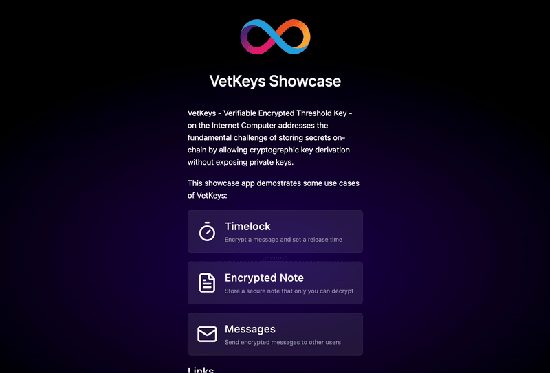

# VetKeys Showcase

A demonstration application showcasing **VetKeys** (Verifiable Encrypted Threshold Keys) on the Internet Computer. VetKeys addresses the fundamental challenge of storing secrets on-chain by enabling cryptographic key derivation without exposing private keys.



## Overview

This showcase demonstrates three distinct use cases for VetKeys, each highlighting different aspects of the technology:

### 1. TimeLock

Uses identity-based encryption (IBE) with timestamps as identities. Messages are encrypted with a future timestamp, and the canister can derive the decryption key only after that time has passed. This enables time-delayed decryption where data becomes publicly accessible at a predetermined time.

**Key Feature**: Canister-side decryption is acceptable since the data is intended to become public after the time lock expires.

### 2. Encrypted Notes

Demonstrates personal key derivation using VetKeys. Users derive their own cryptographic keys, which are encrypted and transported securely to the frontend for local encryption/decryption. The canister stores only encrypted data and never accesses plaintext content.

**Key Feature**: All encryption and decryption happen client-side, ensuring maximum privacy.

### 3. Messages

Implements identity-based encryption for user-to-user messaging. Senders encrypt messages using the recipient's username as the IBE identity. Recipients derive their personal VetKeys in the frontend to decrypt received messages.

**Key Feature**: Enables secure messaging without requiring prior key exchange between users.

## Try It!

ICP Ninja is a browser IDE for creating Internet Computer smart contracts. Write and deploy entire applications directly on-chain from your browser. Deploy this example in under a minute:

[](https://icp.ninja/editor?g=https://github.com/kristoferlund/ic-vetkey-showcase/tree/chainkey-testing-canister)

You can also try a predeployed version:

[https://ddnbn-miaaa-aaaal-qsl3q-cai.icp0.io](https://ddnbn-miaaa-aaaal-qsl3q-cai.icp0.io/)

> [!IMPORTANT]
> This is a demonstration application not intended for production use. Do not use it to store sensitive information. As a demo app, the code is not optimized for security or performance. Most canister endpoints are public and can be called by anyone.

## Prerequisites

- [dfx](https://internetcomputer.org/docs/building-apps/getting-started/install) >= 0.26.0
- [pnpm](https://pnpm.io/) package manager

## Local Development

1. **Install dependencies:**

   ```bash
   pnpm install
   ```

2. **Start the local Internet Computer replica:**

   ```bash
   dfx start --clean --background
   ```

3. **Deploy the canisters:**

   ```bash
   dfx deploy
   ```

4. **Open the application:**
   The frontend will be available at the URL shown in the deploy output, typically `http://localhost:4943/?canisterId=<frontend-canister-id>`

## Technology Stack

- **Backend**: Rust with IC CDK
- **Frontend**: React with TypeScript, Vite, TailwindCSS
- **Cryptography**: VetKeys for key derivation, IBE for encryption
- **Blockchain**: Internet Computer Protocol (ICP)

## Project Structure

```
src/
├── backend/              # Rust canister code
│   ├── timelock/        # TimeLock feature implementation
│   ├── encrypted_notes/ # Encrypted notes feature
│   └── message/         # Messaging feature
└── frontend/            # React frontend application
    ├── timelock/        # TimeLock UI components
    ├── encrypted-notes/ # Encrypted notes UI
    └── message/         # Messaging UI
```

## Learn More

- [VetKeys Documentation](https://internetcomputer.org/docs/references/vetkeys-overview/)
- [VetKeys Tools and Libraries](https://github.com/dfinity/vetkeys)
- [Internet Computer Developer Documentation](https://internetcomputer.org/docs/current/developer-docs/)
